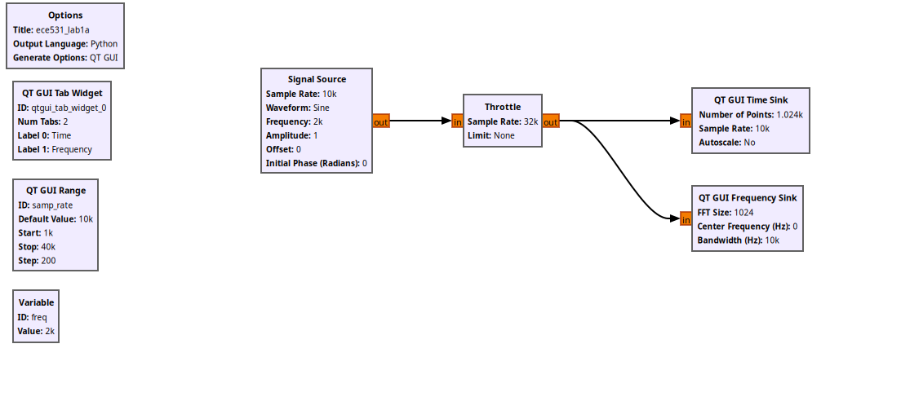
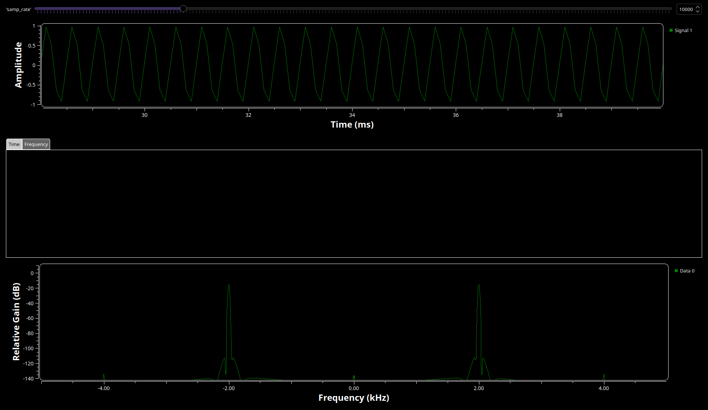
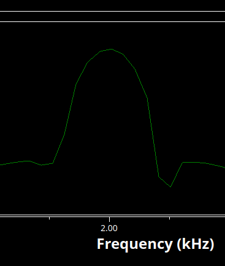
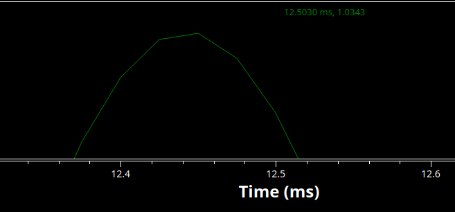
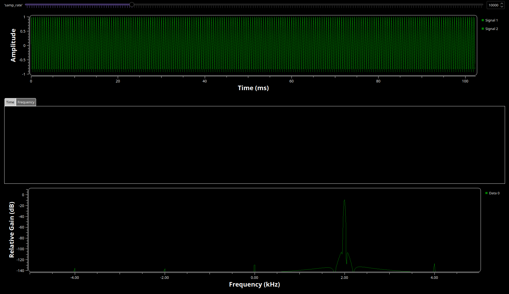

# ECE 531 | Software Defined Radio

Name: Alan Manuel Loreto Cornídez

## Part 3.2 | Sampling Rates

Below is a screenshot of the constructed signal flow graph:

When executing the previously shown signal flow graph, we get the following GUI
popup.

Examining the time domain signal of that is displayed, we can notice quite a bit
of aliasing in the time sink gui module. This is initially an odd experience
because up to this point, we have been taught that as long as our sample rate is
double the frequency of interest, then we can perfectly reconstruct a signal
back from it's samples. So not seeing the perfect sine wave (that is currently
at 2kHz).

However, when looking at the output on the gui, we see that this isn't the case.
The measured signal frequency when sampling at a rate of 10kHz is approximately
2kHz for the signal as expressed by holding the mouse over the peak of the
signal in the frequency sink gui module.

When increasing the sample rate using the slider, the definition of the
time-domain wave begins to increase, that is, the graph that is shown looks like
a smoother sine wave then the wave shown with only 10k samples. This is likely
solely because there are more samples that are being captured in the time
domain, which allows the time sink to show the wave with more definition. One of
the main aspects of the wave that is more accurate is the amplitude of the wave.
When looking at resources present in the DSP industry, such as this article by
[Seimens](https://community.sw.siemens.com/s/article/digital-signal-processing-sampling-rates-bandwidth-spectral-lines-and-more),
we can see that they recommend sampling at a sample rate at least 10x higher
than the frequency of interest. Seimens state that finding the correct amplitude
of the signal in the frequency domain only requires that the sample rate be 2x
higher than the frequency of interest (according to the
[Shannon-Nyquist Theorem](https://en.wikipedia.org/wiki/Nyquist%E2%80%93Shannon_sampling_theorem)),
however, this only applies in the frequency, or the fourier domain.

In practice, when using the time domain, sample rates that are only 2x greater
than the frequency of interest render a wave with inaccurate amplitudes, this is
shown to be the case in te time domain representation of the wave when the
sample rate was 10kHz. However, as shown in the image below, the amplitude is
closer to 1 (the actual amplitude of the signal source) when the sample rate is
raised to 40kHz.

When changing the sample rate to 3.5 kHz, there is quite an interesting change
in both the frequency representation and time domain representation.

In the frequency domain, the measured peak of the signal is 1.5kHz. This is a
change in about 500 Hz from the actual frequency of the signal. The reason for
this is because of the normalization of frequency of the sampled signal.

Taking the actual frequency of the signal: 2kHz, we know that the sample rate is
not high enough to represent the signal in the frequency domain. This causes
aliasing/frequency mis-normalization appearing in the gnuradio.

## Part 3.3 | Complex Sampling

When changing the code blocks to process 'Complex' instead of 'Float' we notice
a few changes. First and foremost, the color of the inputs and outputs becomes
blue instead of orange. When executing the flow graph we see two major changes.
The first change happens in the frequency domain. There is notably, only one
peak on the positive side of the frequency spectrum instead of the two that were
previously present. Shifting our attention to the time domain, we get the gui
telling the user that there are two sample signals. At first I thought that this
was an error, however, after some debugging I realized that it was not. I found
it to be quite interesting. I don't know what the implications of this are.

Things to note:

- There is now only one peak in the frequency domain

- There are now two signals present in the time domain the phase relationship
  between them is about 90 degrees.

- Changing the sampling rate from 10kHz to 40kHz does not have as drastic of an
  effect on the amplitude of the time domain signal as the signal that was
  sampled using 'Floats'

- The measured frequency of the signal at a sample rate of 40kHz is 2kHz for the
  signal. (this is also true for a sample rate of 10kHz).

- When reducing the sample rate from 4kHz to 3.5 kHz we can examine that the
  peak on the frequency spectrum slowly moves to the right until the peak moves
  to the left side of the base-band. This indicates that a change in phase is
  being detected in our signal.

- Continuing to reduce the sample rate causes te frequency domain display to
  move the peak closer to zero. This happens at sample rates of 2kHz and 1kHz.
  which are both integer multiples/divisors of 2kHz.

## Part 3.4 | Frequency Observations

After adding the frequency slider to the sfg on gnuradio, we can shift the
frequency of the source signal over a range of frequency. One thing to note
regarding the display of the frequency peak displayed in the frequency sink
module is the fact that the frequency keeps cycling through the possible
frequency ranges up to the sample rate. after that, the frequency jumps to the
negative side and keeps increasing. This is because as the frequency of the
signal approaches the frequency of hte sampling rate, the normalized frequency
is calculated to the the negative frequency (that is, a phase shift of 2pi).
This happens when converting a signal from the continuous domain to the digital
domain.

### Part 3.4.2 | Real Sampled Flowgraph

When changing the frequency of the signal using 'Real' sampling, the behavior of
the frequency sink changes in a few ways. For example, as the frequency of the
signal approaches the sample rate frequency, the peak displayed in the frequency
sink approaches 0 hz, or a dc signal. intuitively this makes sense, because if
samples are being taken at the frequency of the signal, then the value of the
signal is the same each time we are sampling, thus making our signal appear to
never change. (This is different to the phase shift experienced in the complex
sampling section.)

## Part 3.5 | I/Q Imbalance

When changing the slider for the phase in the Imbalance generator, the oval that
is created in the Constellation sink rotates about the center of its axis. This
effect, however, is very slight. The reason for this shift around the oval is
due to the way that the constellation is generated. Recall that the
constellation diagram is a representation of a signal modulated by the
modulation scheme you're using. In this case, it is quadrature amplitude
modulation or phase key shifting. Regardless, the angle of a point from the
x-axis represents the phase shift of the carrier wave from a reference phase.

Following this line of thinking, we know that the amplitude is the distance from
the origin. We can see that the parts of the constellation diagram that move
away from the origin of the graph are the parts that are on the real axis. The
oval changes shape to conform to the points moving on the x-axis.

Increasing the sample rate and repeating the previous procedures gives similar
results as well. However, with different magnitudes. In addition, we can also
begin to see the rotation of the points as they are being traced. It almost
looks like the output from a curve tracer if you have every used those.

