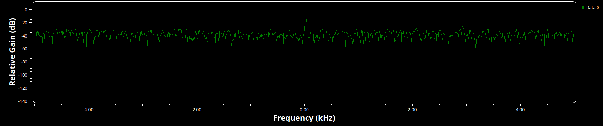

# ECE 531 | Software Defined Radio

**Lab 1 | Introduction to Software Defined Radio**

**Student Name** | Alan Manuel Loreto Cornídez

**Submission Date** | 02/08/2024

\newpage

\thispagestyle{empty}
\clearpage
\tableofcontents
\pagenumbering{roman}
\clearpage
\pagenumbering{arabic}
\setcounter{page}{1}

## Part 3.2 | Sampling Rates

Below is a screenshot of the constructed signal flow graph:

When executing the previously shown signal flow graph, we get the following GUI
popup.

Examining the time domain signal of that is displayed, we can notice quite a bit
of aliasing in the time sink gui module. This is initially an odd experience
because up to this point, we have been taught that as long as our sample rate is
double the frequency of interest, then we can perfectly reconstruct a signal
back from it's samples. So not seeing the perfect sine wave (that is currently
at 2kHz).

However, when looking at the output on the gui, we see that this isn't the case.
The measured signal frequency when sampling at a rate of 10kHz is approximately
2kHz for the signal as expressed by holding the mouse over the peak of the
signal in the frequency sink gui module.

When increasing the sample rate using the slider, the definition of the
time-domain wave begins to increase, that is, the graph that is shown looks like
a smoother sine wave then the wave shown with only 10k samples. This is likely
solely because there are more samples that are being captured in the time
domain, which allows the time sink to show the wave with more definition. One of
the main aspects of the wave that is more accurate is the amplitude of the wave.
When looking at resources present in the DSP industry, such as this article by
[Seimens](https://community.sw.siemens.com/s/article/digital-signal-processing-sampling-rates-bandwidth-spectral-lines-and-more),
we can see that they recommend sampling at a sample rate at least 10x higher
than the frequency of interest. Seimens state that finding the correct amplitude
of the signal in the frequency domain only requires that the sample rate be 2x
higher than the frequency of interest (according to the
[Shannon-Nyquist Theorem](https://en.wikipedia.org/wiki/Nyquist%E2%80%93Shannon_sampling_theorem)),
however, this only applies in the frequency, or the fourier domain.

In practice, when using the time domain, sample rates that are only 2x greater
than the frequency of interest render a wave with inaccurate amplitudes, this is
shown to be the case in te time domain representation of the wave when the
sample rate was 10kHz. However, as shown in the image below, the amplitude is
closer to 1 (the actual amplitude of the signal source) when the sample rate is
raised to 40kHz.

When changing the sample rate to 3.5 kHz, there is quite an interesting change
in both the frequency representation and time domain representation.

In the frequency domain, the measured peak of the signal is 1.5kHz. This is a
change in about 500 Hz from the actual frequency of the signal. The reason for
this is because of the normalization of frequency of the sampled signal.

Taking the actual frequency of the signal: 2kHz, we know that the sample rate is
not high enough to represent the signal in the frequency domain. This causes
aliasing/frequency mis-normalization appearing in the gnuradio.

## Part 3.3 | Complex Sampling

When changing the code blocks to process 'Complex' instead of 'Float' we notice
a few changes. First and foremost, the color of the inputs and outputs becomes
blue instead of orange. When executing the flow graph we see two major changes.
The first change happens in the frequency domain. There is notably, only one
peak on the positive side of the frequency spectrum instead of the two that were
previously present. Shifting our attention to the time domain, we get the gui
telling the user that there are two sample signals. At first I thought that this
was an error, however, after some debugging I realized that it was not. I found
it to be quite interesting. I don't know what the implications of this are.

Things to note:

- There is now only one peak in the frequency domain

- There are now two signals present in the time domain the phase relationship
  between them is about 90 degrees.

- Changing the sampling rate from 10kHz to 40kHz does not have as drastic of an
  effect on the amplitude of the time domain signal as the signal that was
  sampled using 'Floats'

- The measured frequency of the signal at a sample rate of 40kHz is 2kHz for the
  signal. (this is also true for a sample rate of 10kHz).

- When reducing the sample rate from 4kHz to 3.5 kHz we can examine that the
  peak on the frequency spectrum slowly moves to the right until the peak moves
  to the left side of the base-band. This indicates that a change in phase is
  being detected in our signal.

- Continuing to reduce the sample rate causes te frequency domain display to
  move the peak closer to zero. This happens at sample rates of 2kHz and 1kHz.
  which are both integer multiples/divisors of 2kHz.

## Part 3.4 | Frequency Observations

After adding the frequency slider to the sfg on gnuradio, we can shift the
frequency of the source signal over a range of frequency. One thing to note
regarding the display of the frequency peak displayed in the frequency sink
module is the fact that the frequency keeps cycling through the possible
frequency ranges up to the sample rate. after that, the frequency jumps to the
negative side and keeps increasing. This is because as the frequency of the
signal approaches the frequency of hte sampling rate, the normalized frequency
is calculated to the the negative frequency (that is, a phase shift of 2pi).
This happens when converting a signal from the continuous domain to the digital
domain.

### Part 3.4.2 | Real Sampled Flow Graph

When changing the frequency of the signal using 'Real' sampling, the behavior of
the frequency sink changes in a few ways. For example, as the frequency of the
signal approaches the sample rate frequency, the peak displayed in the frequency
sink approaches 0 hz, or a dc signal. intuitively this makes sense, because if
samples are being taken at the frequency of the signal, then the value of the
signal is the same each time we are sampling, thus making our signal appear to
never change. (This is different to the phase shift experienced in the complex
sampling section.)

## Part 3.5 | I/Q Imbalance

When changing the slider for the phase in the Imbalance generator, the oval that
is created in the Constellation sink rotates about the center of its axis. This
effect, however, is very slight. The reason for this shift around the oval is
due to the way that the constellation is generated. Recall that the
constellation diagram is a representation of a signal modulated by the
modulation scheme you're using. In this case, it is quadrature amplitude
modulation or phase key shifting. Regardless, the angle of a point from the
x-axis represents the phase shift of the carrier wave from a reference phase.

Following this line of thinking, we know that the amplitude is the distance from
the origin. We can see that the parts of the constellation diagram that move
away from the origin of the graph are the parts that are on the real axis. The
oval changes shape to conform to the points moving on the x-axis.

Increasing the sample rate and repeating the previous procedures gives similar
results as well. However, with different magnitudes. In addition, we can also
begin to see the rotation of the points as they are being traced. It almost
looks like the output from a curve tracer if you have every used those.

## Part 3.6 | Adding Noise

Before typing out my thoughts, take a look at the three graphs:

The diagrams are heavily modified when compared to their non-noise containing
counterparts.

First, the time sink has the most obvious straightforward change. Mostly, the
signal stops looking like a sine wave and begins to look more like a random
wave. The trigger that I set in the time sink also has a hard time linking up
the wave so it is constantly shifting when trying to look at it in the time sink
module.

The frequency sink is also different, however it may not look like this is the
case at first sight. However, upon close examination, you can see that the
frequency ranges that are not in our interest, that is, everything that is not
at or near 2kHz has a higher relative magnitude when compared to the previous
magnitude values in previous sections of the lab. This is because the noise
introduces more frequency components in the signal that is evaluated and thus,
the signal that we are interested is less powerful. (Relative to all of the
frequency components contained in the signal.)

The constellation diagram is messed up completely. Since our noise source does
not have a focused frequency range, we don't get a nice oval now. Instead, we
have random points that are constantly changing. However, if we zoom out we can
see that all of the points are still centered about the origin of the
constellation diagram.

## Part 3.7 | Interpolation and Decimation

Below is the constructed signal flow graph.

And the output after running the aforementioned signal flow graph:

When observing the time and frequency outputs in the GUI sinks, you can see that
the frequencies are interpreted to be different.

Signal 1 is resampled with with an interpolation of 1 and decimation of 1. This
makes the output shown in the GUI sinks to be the same as if they weren't used
at all. However, when examining the other two outputs, we get a different story
entirely.

Signal 2 has an interpolation of 4 with a decimation of 1. This causes the time
sink to interpret the frequency of the signal to be $1/4$ of the actual
frequency, of 250 Hz.

The second signal is affected in a similar way. With an interpolation value of 1
and a decimation value of 4, we get the inverse situation. This signal is
interpreted to be at a frequency of 4kHz instead.

## Questions

1. What are the benefits of using in-phase and quadrature (I & Q) samples for
   SDR? Fully describe at least three benefits of IQ sampling.

   - You remove the 'negative' frequencies that are present in the frequency
     response.
   - Allows for base-band processing of a signal.
   - Allows for signal processing sample rates to be lowered.

2. In GNU Radio What is the Throttle block for? When should it be used? What
   happens if you use more than one throttle block? When is a throttle block
   unnecessary?

   - The throttle block used to limit the sample rate of a signal flow graph if
     one isn't already present. (Usually Hardware). Using more than one throttle
     block is not advised ever. This can cause lag in the signal processing of
     the chain. You do not need to use a throttle block if there is already a
     rate limiting block in your signal flow graph (like a microphone or an
     SDR).

3. What are Nyquist zones? How are they useful with software-defined radio?

   - According to
     [Science Direct](https://www.sciencedirect.com/topics/engineering/nyquist-frequency),
     Nyquist zones subdivide the frequency spectrum into sections that span the
     length of the integer multiples of the sample rate used in the signal
     chain. Odd numbered Nyquist zones contain a replica of the frequency
     spectra while odd numbered Nyquist zones contain a mirror frequency
     spectra.

4. Why is dither noise used on Digital-to-Analog converter (DAC) circuits?

   - Dither is added to DAC circuits to reduce quantization error that is
     present in the digital to analog conversions. This works because the noise
     is not correlated with time or the input signal, and is a constant factor.

## Conclusion

This lab was a good way to 'get my feet wet' with the gnuradio software. It was
useful by allowing me to set up the software on my linux system. From the DSP
part, gnuradio is a good platform to test a lot of the simple questions that I
may think of, such as how sample rates and buffer sizes affect the interpreted
frequency of a signal. One of the most interesting aspect about this lab was the
sample rate affecting the amplitude of the time domain response in the signals.
I remember doing an internship where they would use sample rates on switching
amplifiers to be 10x the highest frequency of interest and I always wondered why
we didn't use the Nyquist frequency instead. All in all, there was tons of
learning all around and I'm excited to learn more.
