# ECE 531 | Lab 2 - Getting Started on PlutoSDR

Name: Alan Manuel Loreto Cornidez

Course: ECE 531 | Software Defined Radio

Due Date: 02/19/2024

\newpage

\thispagestyle{empty} \clearpage \tableofcontents \pagenumbering{roman}
\clearpage \pagenumbering{arabic} \setcounter{page}{1}

## 2 | Required Software

### Matlab

I can run one of the example programs on my linux computer with matlab
installed:

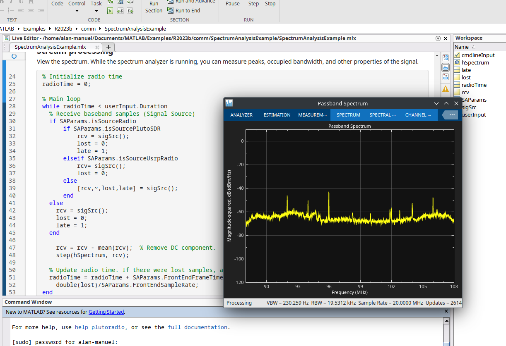

This is actually surprising because getting Matlab installed on my computer was
difficult (I don't use Ubuntu).

### GNU Radio

GNU radio was working fine last lab.

#### IIO-Scope

IIO-Scope was installed and is working fine.

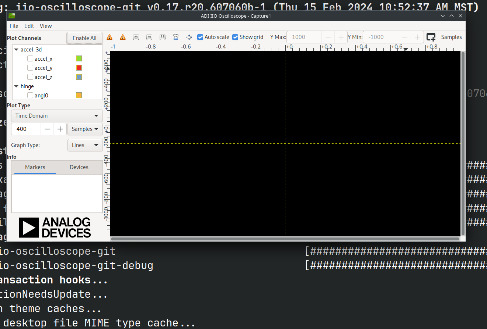

### SSH Connection

The ssh connection to the pluto was working fine as well:

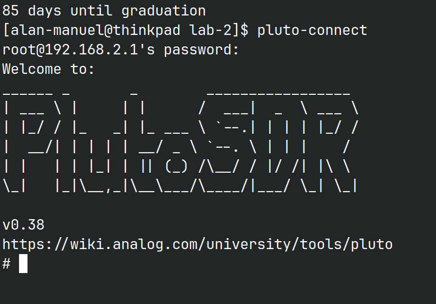

## 3 | Industrial Input/Output (IIO)

Here is my `iio_info -s` output on my local computer.

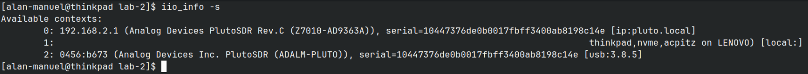

And here is my output on the pluto:

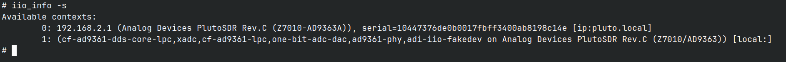

We can see that the iio on my laptop outputs the USB Pluto as well as the local
ip for the Pluto (in addition to the local laptop) whereas the output on my
Pluto outputs the local host to the ssh server as well as the system on the
Pluto itself (and all of the iio devices on the Pluto).

We can use

```sh
iio_attr -d --uri ip:192.168.2.1
```

To display the attributes of the device.

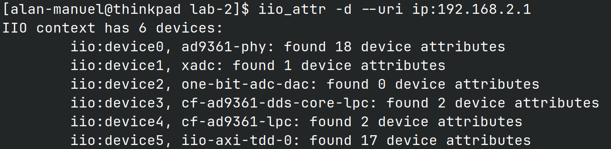

After catting the name we can see the following output (in addition to all of
the contents in this directory)

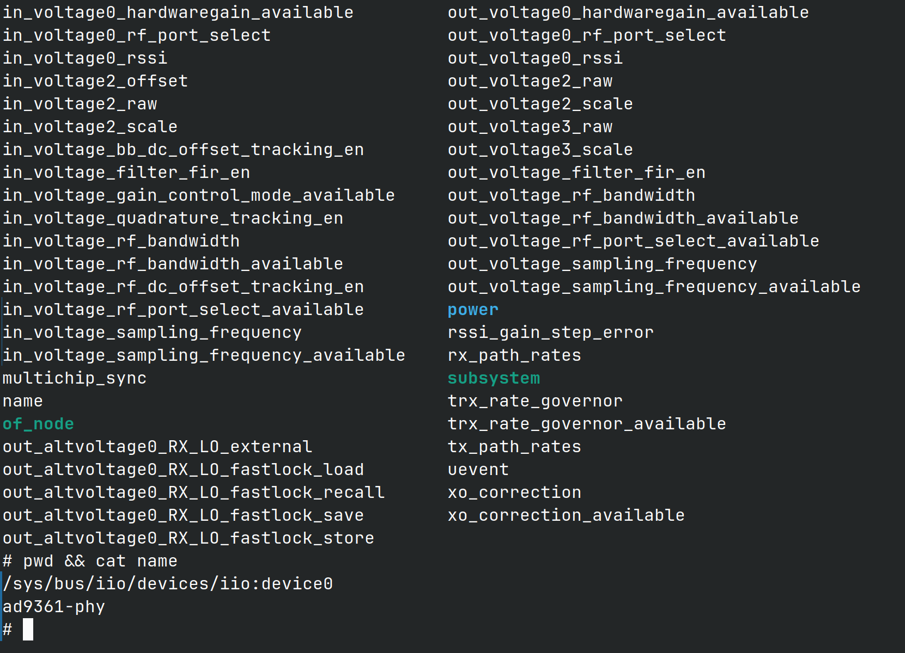

```
cd /sys/bus/iio/devices/
```

All of those files, I assume, are used to control the values of the outputs of
components. We can use IIO Oscilloscope for debugging these values as well.

## 4 | Radio Setup and Environmental Noise Observations

Entering the command into MATLAB

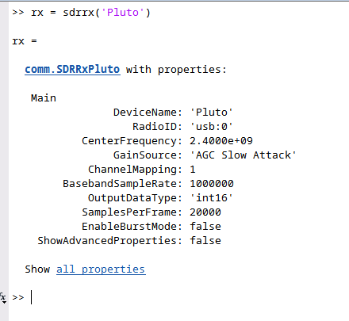

Pulling up the documentation for the pluto:

SDRR: 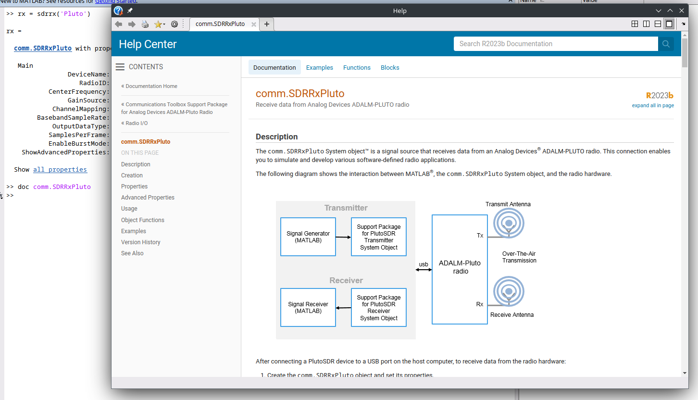

SDRT: 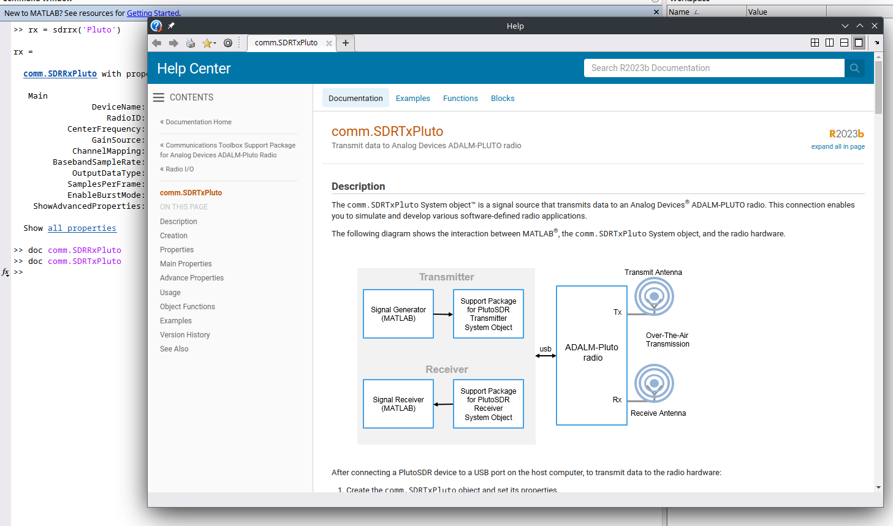

### loopback.m

After connecting the coaxial cable, I was able to run the provided `loopback.m`
script and recieved the following output:

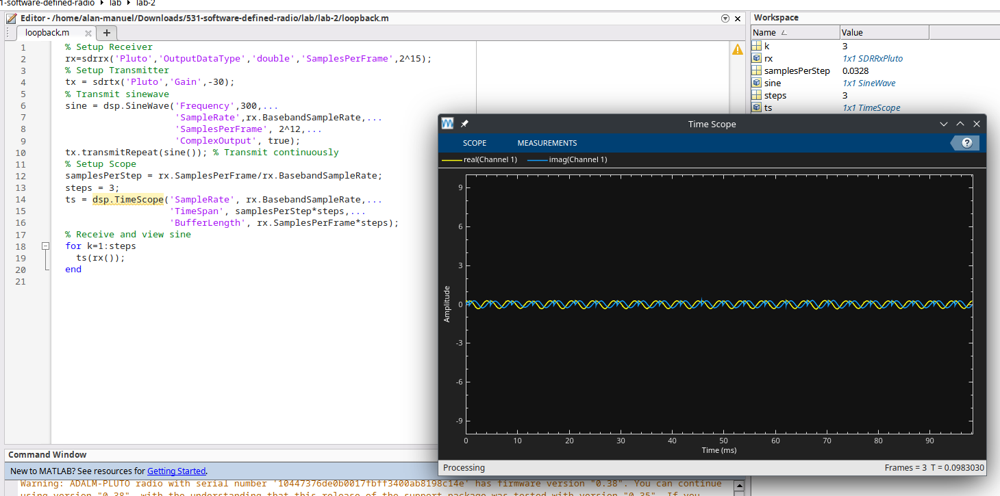

Zooming in on the waveform we can see this:

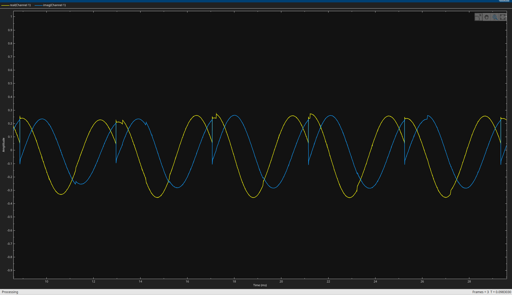

#### Modifying the Script

1. Modifying the samplitude of the sine wave

Slow Attack: 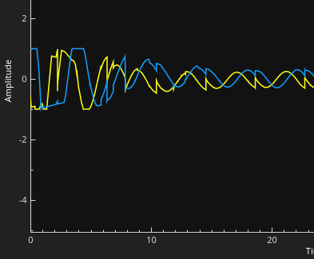

Fast Attack: 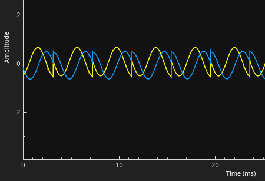

Manual: 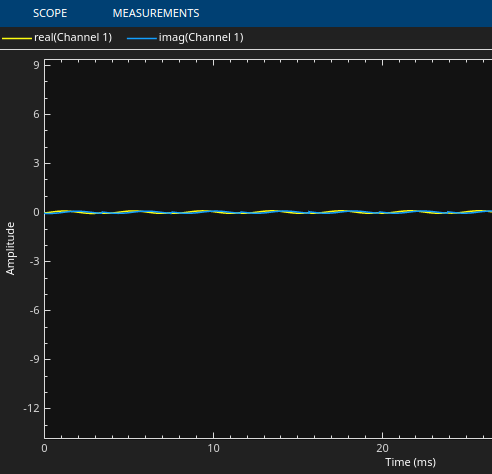

The gain value must be set at this point.

Setting the gain value to 70 causes this square-wave looking output output:

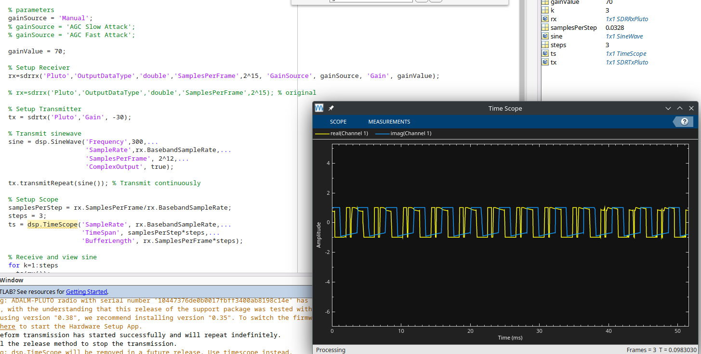

The square-wave-like signal likely happens because of railing on the
output/input hardware.

Here is the output when gain is 32. 

Breakdown begins to occur at about 34 for the gain value.

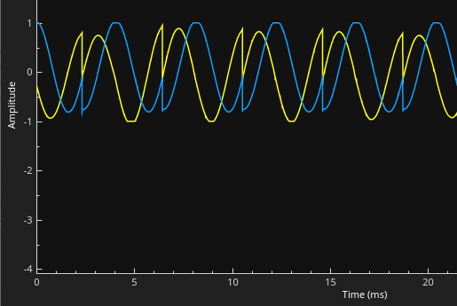

### GNU Radio Loopback

Here is the output when generating the SFG and running the generated python
scripts:

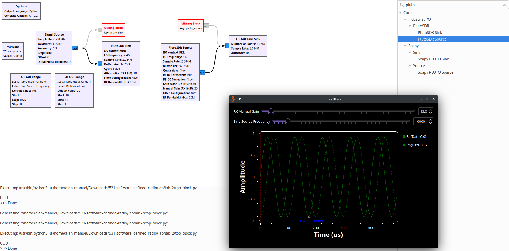

1. I added the pluto by searching for the module on the right.
2. I control the gain of the signal by using the gui variable (assigned it
   inside the pluto block by changing the gain mode, similar to the matlab
   method)

Adding a frequency sink (so that it matches the document while also including
the time sink gives this output):

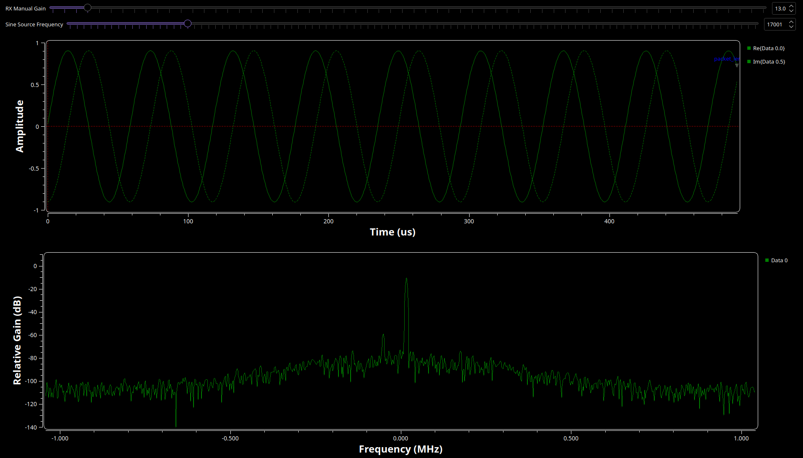

Here is the SFG from gnuradio:

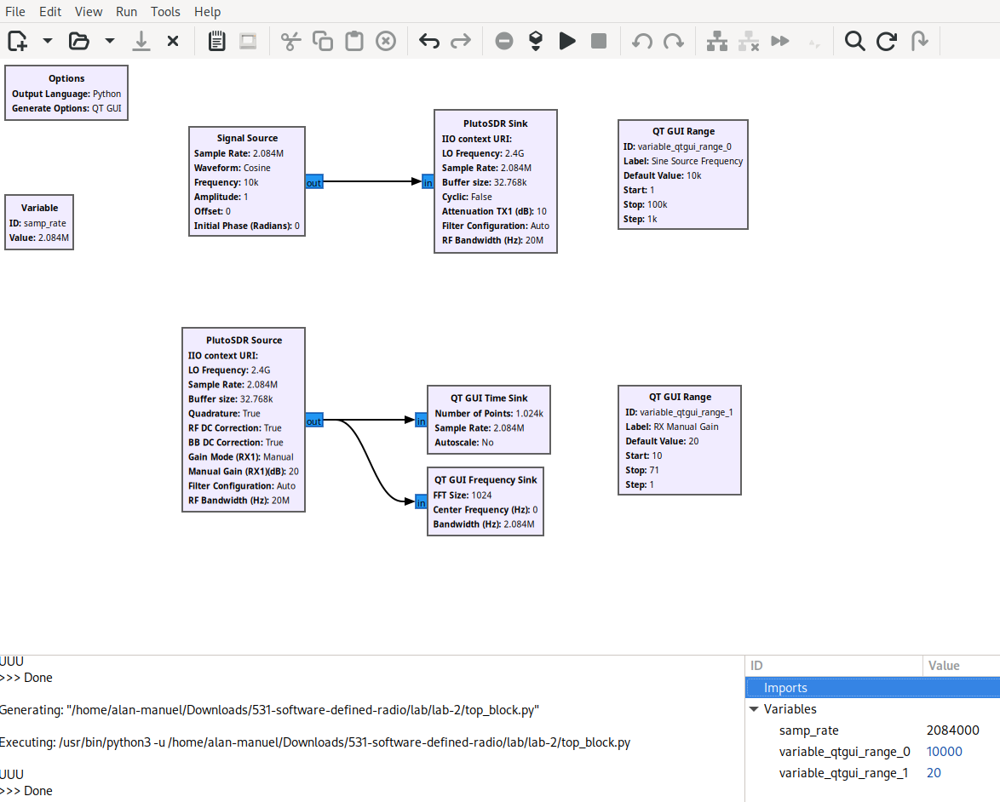

#### Double-click on each PlutoSDR block (source and sink) to look at the block properties.

- What is the RF Bandwidth? What does this property control in the PlutoSDR?

  - **RD bandwidth is the total frequency range that the SDR (in this case, the
    Pluto) is able to receive at any given time.**

- What is the “Cyclic” boolean selection for in the PlutoSDR Sink block?

  - **The Cyclic boolean selection for the PlutoSDR is used for turning on
    cyclic mode. This allows the first buffer of samples to be repreated on the
    program until the program is stopped. This allows the rest of the program to
    execute while the PlutoSDR blocks stop.**

- What does the Manual Gain control in the PlutoSDR source? What other
  strategies are available?

  - **The manual gain value controls the gain of the transmitter output.**

#### Adjust the RX gain. At what value does the received signal begin to distort or clip?

Run the flowgraph. Note: you may have to enter change the Device URI. On some
operating systems libIIO finds the first available device when this field is
left blank.

In my case there was no need to configure the URI. Linux did that for me.

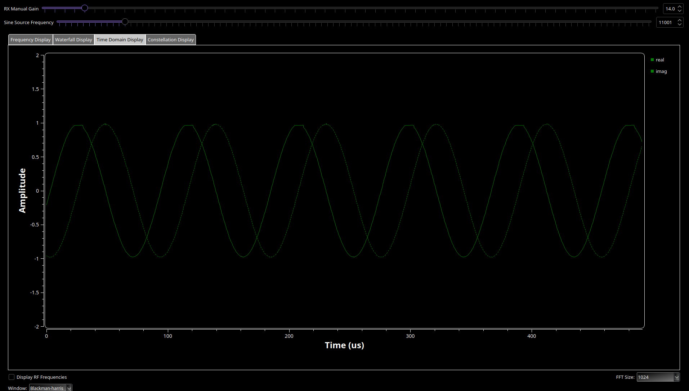

As you can see in the image above, the signal starts to distort at about 14 for
the Rx gain value.

#### Replace the “QT Time Sink” block with a “QT GUI Sink”. Explore the options provided by the new sink block. What happens if you increase the number of averages? Why does the frequency response change when you change the window function?

Changing the number of averages takes an average of the past number of
calculated data points for that field which allows the wave forms to look
cleaner. If I'm not mistaken, this is behaving like a lo-pass filter on the data
points.

The reason for the frequency response changing when I change the windows is
because each window has different spectral leakage parameters that affect the
value that is sampled from the ADC.

#### What is the transmitted RF frequency of the sinusoid?

The transmiitted RF frequency of the sinusoid is 10k. This is becuase that is
the settin on the GUI slider. However when I change the GUI slider the frequency
changes to the corresponding frequency.

### 4.1.3 | Using a Custom IO Block

Below is a screenshot of the signal flow graph in GNU radio:

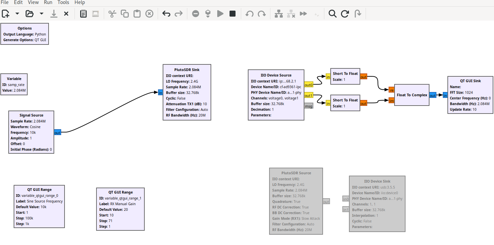

As you can see, the IIO device source block has many parameters.

Let's go through them:

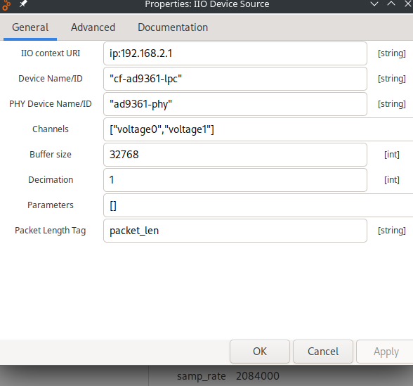

```
ip:192.168.2.1 // this is how your computer communicates with the pluto
```

The way that I was able to do this was by following a workshop done by ADI.

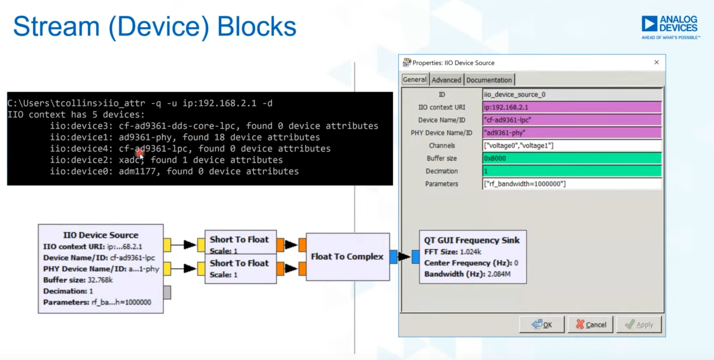

Here is the output of the gui.

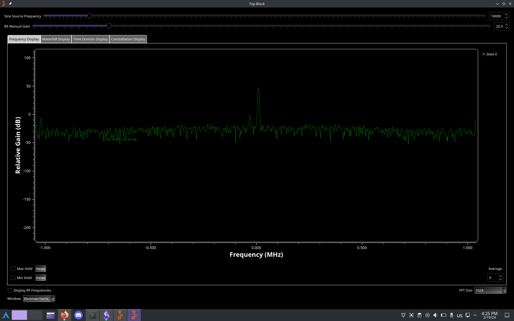

### 4.2 | Measurements and the Radio

Using the gain settings to change the amplitude of the signal

This is a gain value of 10 on the transmit signal.

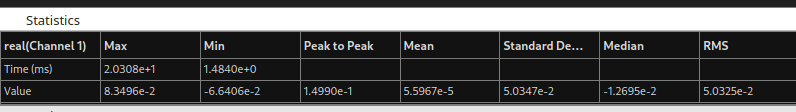

The RMS value in this case is: $5.5.0325 \times 10^{-2}$

When using the gain value at 20: 

We can see the RMS value is: $1.3172 \times 10^{-1}$

Plugging into the formula:

$$
SNR_{dB} = 10\log_{10}\frac{1.1372 \times10^{-1}\ -\
5.50325\times10^{-2}}{5.50325\times10^{-2}} = 0.2792 \text{ dB}
$$

When using the `imnoise` function to add noise to the signal that is transmitted
by the pluto, I get this output:

```matlab
noise = imnoise(sine(), 'gaussian', 0.005);
```

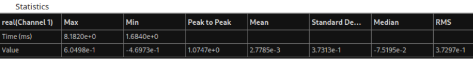

We get an RMS value of $3.7297\times10^{-1}$

When getting the rms from the no-noise sinewave: You can see the RMS is
$2.8998\times10^{-1}$

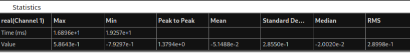

Plugging those values into the equation:

$$
SNR_{dB} = 10\log_{10}\frac{3.7297\times10^{-1}\ -\
2.8998\times10^{-1}}{2.8998\times10^{-1}} = -5.43342280935 \text{ dB}
$$

When using the different methods, I see that the numbers that result are
actually quite different. To be honest, I don't know why that's the case...

## Conclusions

After doing this lab, I was extremely happy with how well everything seemed to
workout in terms of software compatibility.

I've been using Linux for a while now because I prefer using the terminal in my
workflow. I feel like this is the first time where linux is actually beneficial
to running the programs that are necessary to perform the functions in this
course. While installing matlab was a bit of a hurdle, gnuradio was not. All of
the libiio components were also easy to install, this was due to the fact that
the Arch User Repository had all of the packages that I needed.

Regarding the things that I learned for iio, it was interesting to see how the
interfacing between the Pluto device and the computer was done. Using the ssh
connection to the IP was nt how I expected it to work. One weird issue that
arose was when I used the IIO blocks in gnuradio to connect to the pluto
(instead of using the pluto blocks). This caused an issue with my ssh command
that warned me about a possible man-in-the-middle attack happening on my
computer. A screenshot is shown below of the output from the terminal (note I
created an alias to connect to the pluto):

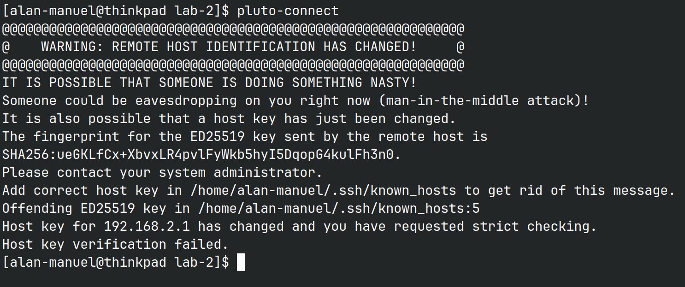

The way to fix this was by removing the pluto from the known ssh hosts and then
connecting to the pluto again.

In addition, trying to interface with the iio blocks was difficult in it's own
way. I struggled for a few days to get the blocks to use the correct arguments.
Not to mention, there is a lot more that goes into transmitting than receiving.

All in all, learning how to interface with the pluto from the commandline,
matlab, and gnudradio was a great experience. I came across many hiccups but am
learning a lot more about interfacing with hardware than I thought I would. The
fact that using linux has been the pragmatic choice in this class is a huge
plus, considering I have some colleagues struggling with VM issues, so it's nice
to not worry about those.
