# ECE 531 | Exploring the RF Spectrum

Name: Alan Manuel Loreto Cornidez

Course: ECE 531 | Software Defined Radio

Due Date: 02/19/2024

\newpage

\thispagestyle{empty} \clearpage \tableofcontents \pagenumbering{roman}
\clearpage \pagenumbering{arabic} \setcounter{page}{1}

## Preparing the Software

Installing the necessary software was simple using the Arch User Repository:

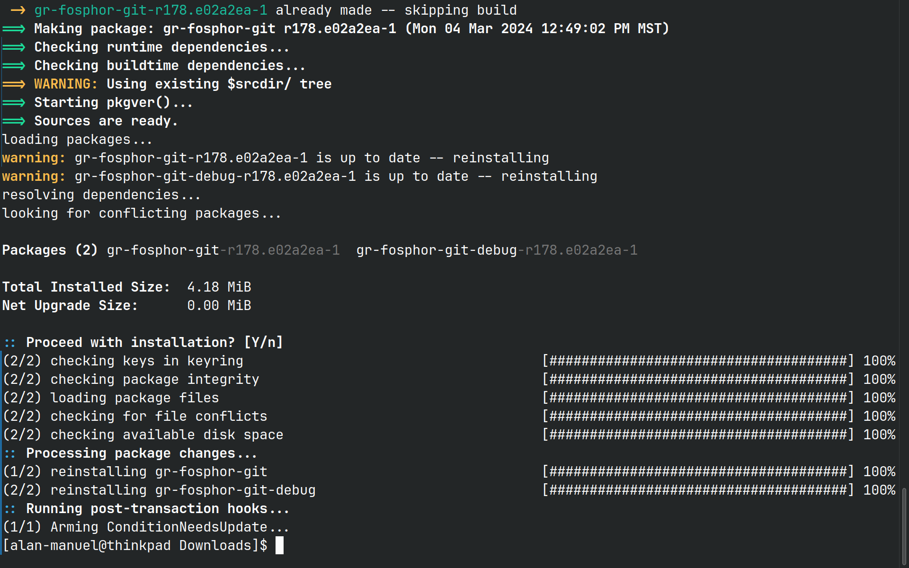

However, after hours of debugging, I was finally able to actually get the program to run. I needed to run the program from the GNU radio signal flow diagrams instead of just running the command line:

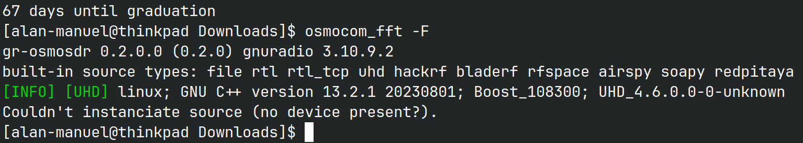

When I ran it from the GNUradio python scripts I also got errors because I needed to install an OpenCL runtime on my computer. 

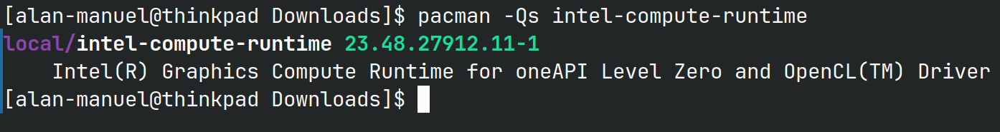

After doing that I was finally able to get Fosphor to run (at a crisp 60+ frams per second may I add):

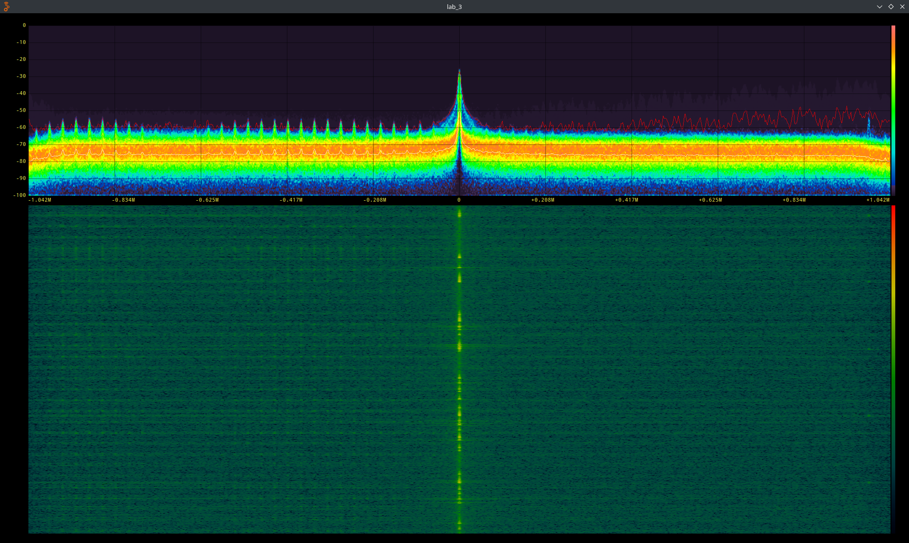

When centering the frequency range around 910MHz, I get some random signals that are recieved by the pluto as well:

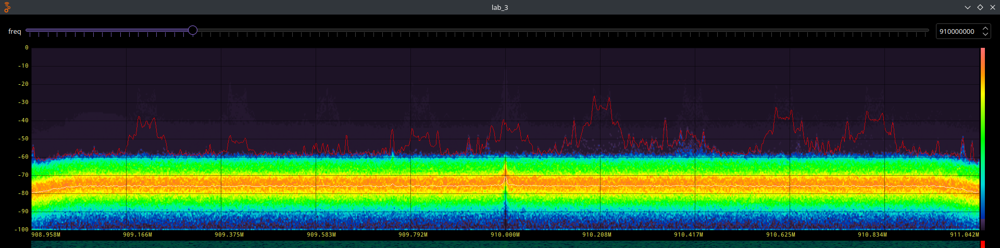

## Spectrum Exploration

After looking at some radio stations, I was able to look at lots of frequency bands in use in Tucson by using this site to look up what bands are being used:
https://www.radioreference.com/db/browse/ctid/103#cid-15817

1. Weather Station

Center frequency at 162 MHz

Here is screenshot of the capture of the signal:

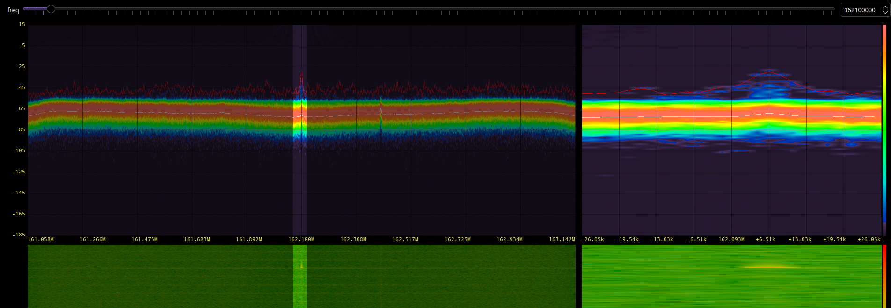

There are not many transmissions as a radio station, but every yellow mark on the bottom is a transmission made that my SDR picks up.

2. Local Radio Stations:

You can see a local Tucson radio station centered at about 99.5 as well. 

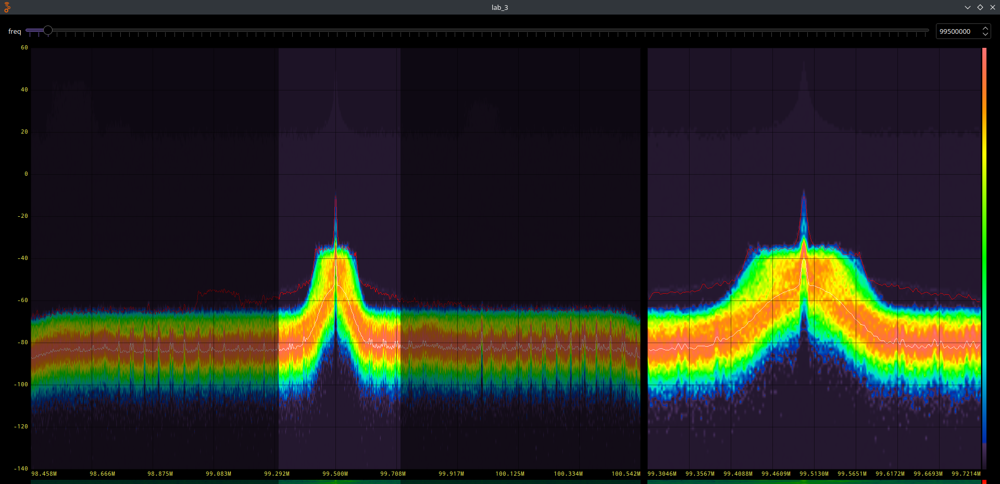

We can also see two stations near each other: 102.1 and 101.7.

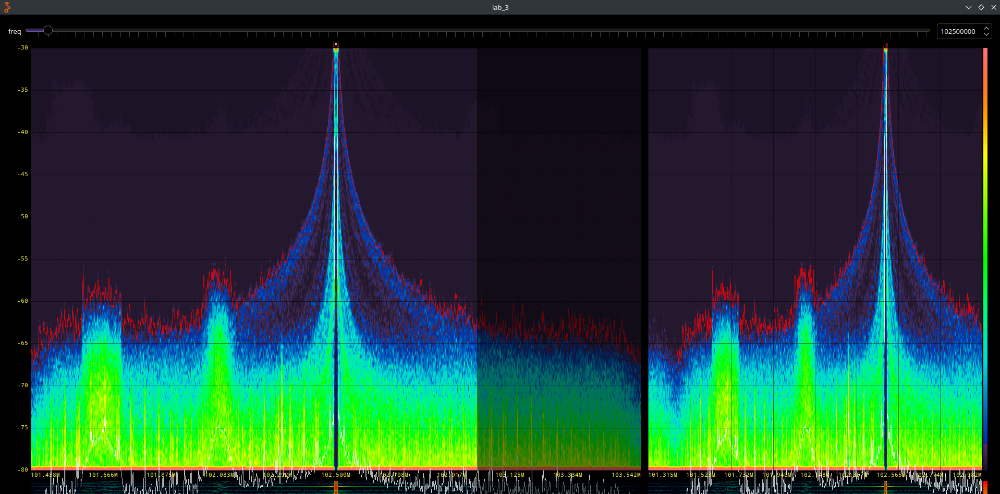

3. LTE Cellular Data

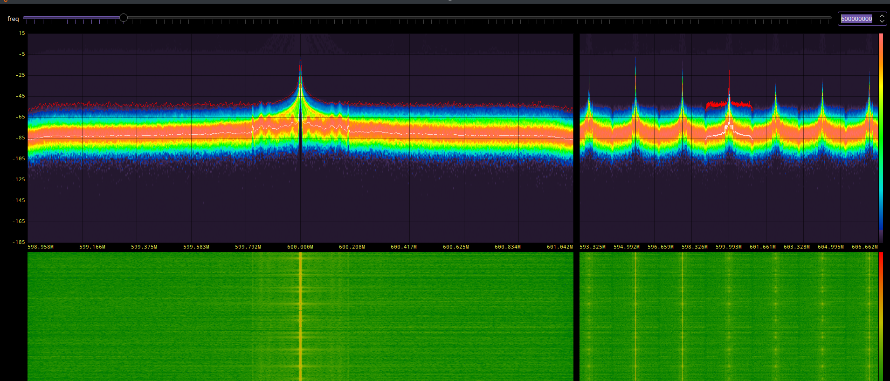

I was able to look at activity that was transmitted from my phone when browsing using my mobile data. This one was an eye opening experience that made me realize that all of my data that I transfer is out in the open air. It is important to think about how we can make these open channels secure.

This data was centered at 60 MHz and I retrieved that information from https://www.sigidwiki.com/wiki/Category:Commercial

4. 
There was one last bit of activity that was interesting, it was centered at about 10.56 MHz and one at 957.6 kHz.

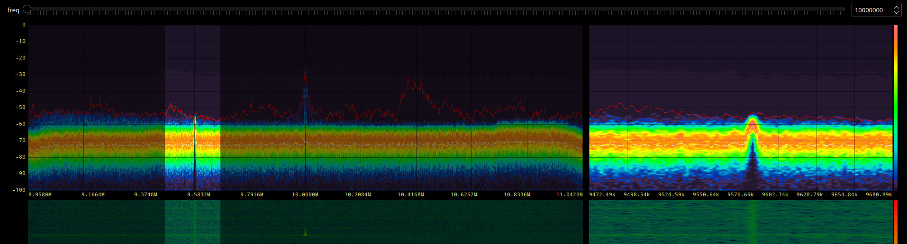

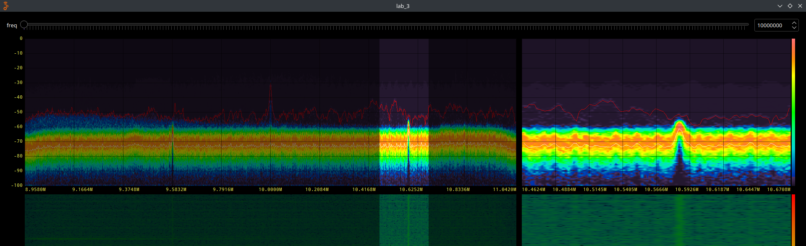

Here is some more activity that I recorded on it.

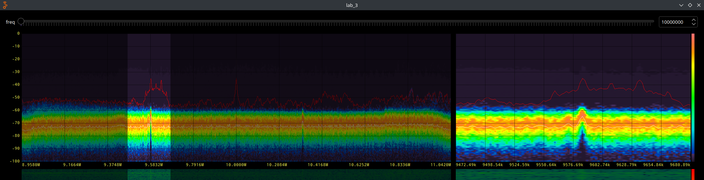

The activity at that frequency band was pretty sporadic, so I couldn't tell what the modulation scheme was. I suspect it was 

## 2.4 GHz Band Observation

Here is screenshot of when my phone was using the WiFi signal near the SDR:

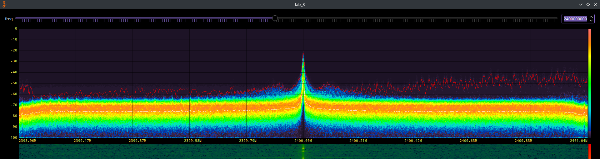

As you can see, there is activity throughout the spectrum. 

## Understanding Your Wireless Devices

The device that I picked was a remote for the fan in my house. 

Here is the spectrum when I held down a button on the remote:

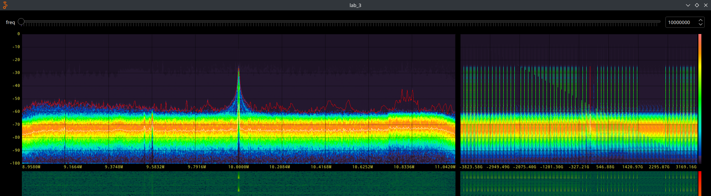

As you can see, the entire spectrum actually had interference which was very interesting to me. the FCC ID was: L3H2010FANHD. After looking up the FCC id, I saw the following data sheet:

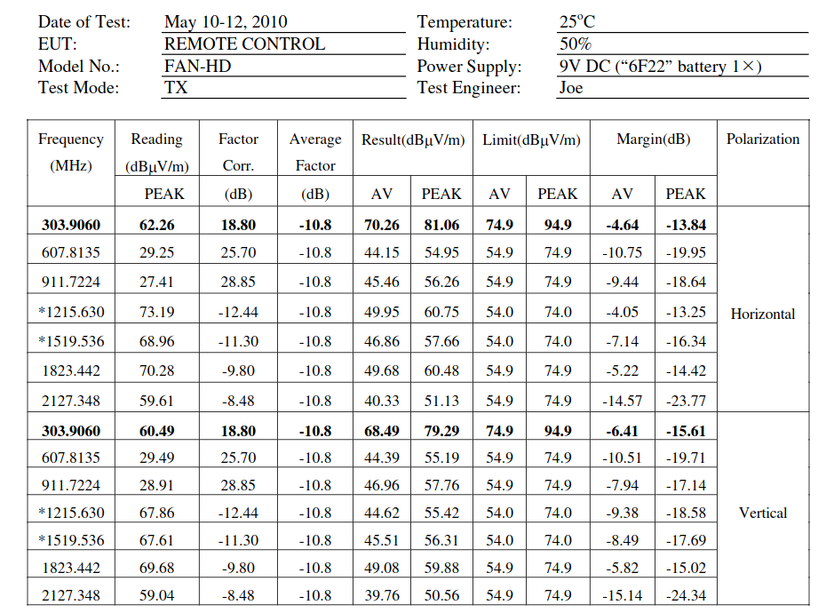

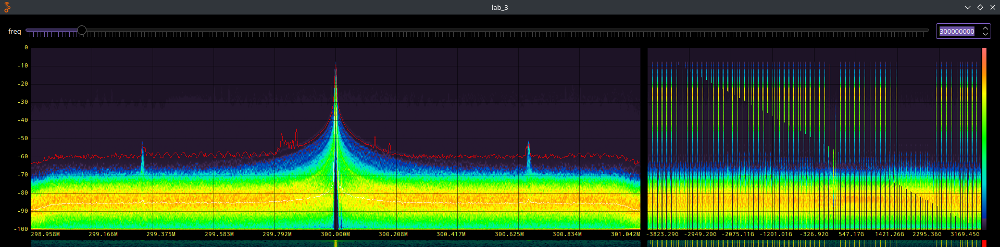

When going to 300MHz, we can see the large signal being generated by the remote at that frequency.

Conducting the Fourier analysis required me to install the inspectrum software:

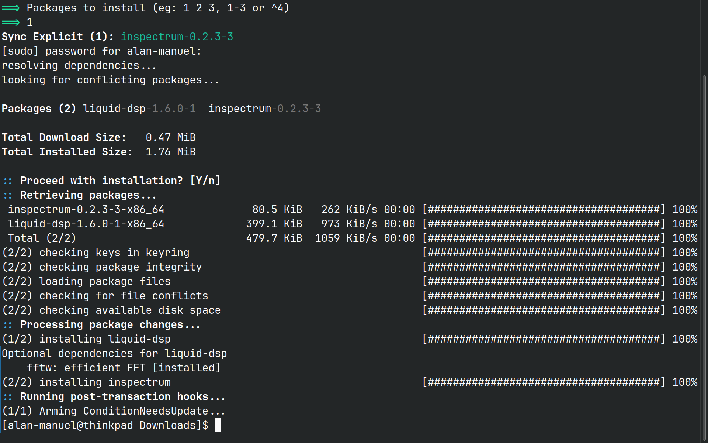

Afterwards, I was able to look at the signal that was being recieved by the remote whenever I clicked the 
high' fan setting.

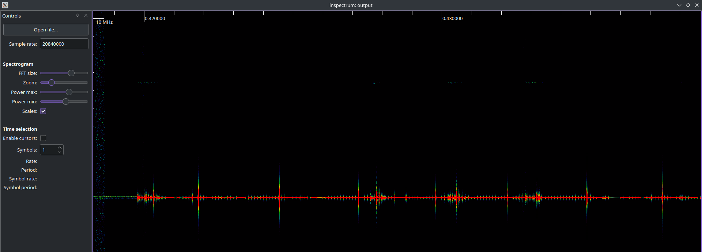

I aslso got curious and decided to try a key fob to the car as well:

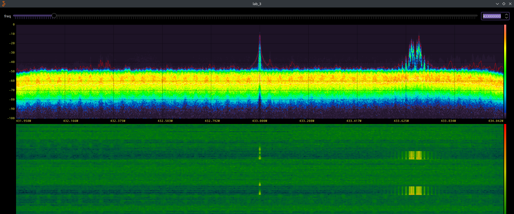

The signal was centered at 433 MHz.

And using inspectrum, I got the capture as well:

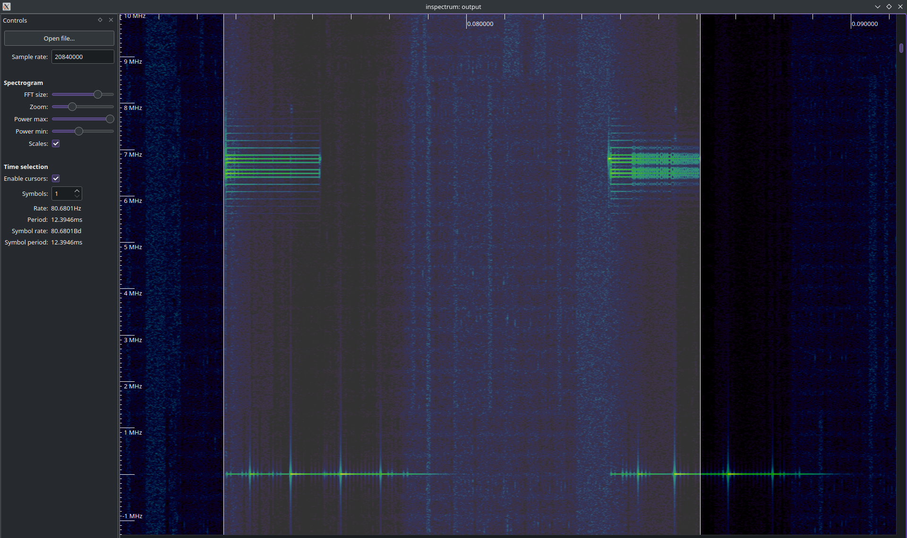

As you can see, there are different signals when I press the button down and when I release the button. 

Frequency analysis by putting the file into the gt GUI frequency sink didn't give me much useful data: 

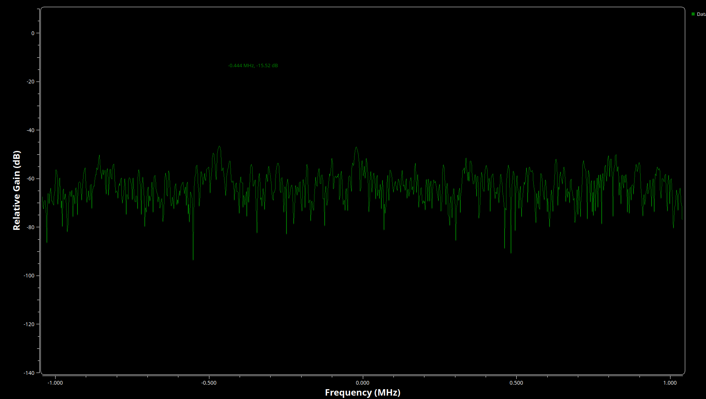

## Conclusion 

This lab was an eye-opening experience. It made me realize how much of the devices we use transmit signals over open air. This makes me heavily consider the security and privacy of our devices. If it was this easy to look at the data that is transmitted on the devices, I can only imagine how easy it would be to transmit other malicious signals through the use of the pluto and other SDR devices. 

