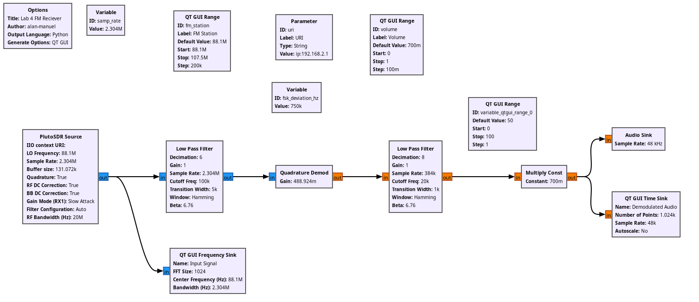

# ECE 531 | Analog Modulation with SDR

Name: Alan Manuel Loreto Cornidez

Course: ECE 531 | Software Defined Radio

Due Date: 02/19/2024

\newpage

\thispagestyle{empty} \clearpage \tableofcontents \pagenumbering{roman}
\clearpage \pagenumbering{arabic} \setcounter{page}{1}

## Task 1.1 | Amplitude Modulation

Using the website to tune w web SDR was interesting. A lot of the things that I
set up last week for lab were already set up for me on the website which was
convenient.


## Task 1.2 | PM & FM

1. Implement a GNU Radio flowgraph for receiving, demodulating, and playing the
   audio of frequency modulated signals. One example is shown above.

Here is a screenshot of the signal flow graph that I created:


2. Capture an image of your received spectrum before and after demodulation.
   (Turn averaging or peak hold on to visualize FM spectrum).

Here is a screenshot of the two waves.


3. Describe what decimation, interpolation, or other resampling was used for the
   blocks in your flowgraph and why.

There were two stages of decimation in the signal pipeline. The first decimation
stage happened in the low pass filter. We used a decimation factor of 6. The
second decimation stage happened during hte FM demodulation stage, which had a
value of 8.

$$\frac{2.04M}{6}= 38400 \rightarrow \frac{384000}{8}= 48000$$

If we take our sample rate of 2.403M and divide it by 6, then 8, we get a value
of 48k, which is the sample rate used in the audio sink to play our audio from
the computer speakers.

4. When would a rational resampler block be necessary? How did I avoid using on
   in Figure 2?

A re-sampler block is necessary when we care about processing signals with lower
frequencies of interest than the nyquist frequency of the sample rate. By down
sampling we can reduce the amount of computation that is necessary, thereby
increasing performance.

5. How does your audio sound? What can we do to improve the quality of the
   audio?

The audio sounds terrible. However, we can improve the audio quality by rotating
the SDR in every which way (and appearing like a madman to everyone in your near
vicinity)

6. Why was a 100 kHZ cut-off frequency used for the LPF in Figure 2?

We want to have an output that has a sample rate of 48k, therefore, we use $48k
\times 2 = 96k$ from the nyquist shannon theorem and add $4k$ for the "skirt" of
the filter.

## Task 2.1 | Manual Demodulation

1. Repeat the Narrow Band FM reception example from the section above, but
   perform the individual demodulation steps. This is accomplished by replacing
   the FM demodulator block with the quadrature demodulator and audio low-pass
   filter.

Here is a screenshot of my signal flow graph:



2. Capture an image of your received spectrum before and after demodulation.
   (Turn averaging or peak hold on to visualize FM spectrum).


3. Describe what decimation, interpolation, or other resampling was used for the
   blocks in your flowgraph and why.

There were a few steps where I used decimation. This was in the low-pass filter
stages before and after the quadrature stages of the signal flow graph. This was
done to remove needless computation when processing the received signals.

I did not use interpolation or resampling, but decimation serves a similar if
not identical purpose.

4. How does your audio sound compared to the previous FM flowgraph? What can we
   do to improve the quality of the audio?

At first the audio was pretty bad. However, after changing the filters to have
some more specific cutoff frequencies it sounded just as good as the previous
part. I was able to play some more of the high end sounds that were cut off from
the signal in the FM demod block.

## Questions

1. Describe how to demodulate an amplitude modulated signal without simply using
   the “AM Demod” block in GNU Radio?

We can simply use a complex to magnitude block followed by a Add Const Block,
then a lowpass filter.

This is a simple kind of audio demodulation, in addition, looking at the source
code of the amdemod block we can figure this out:

```python
    def __init__(self, channel_rate, audio_decim, audio_pass, audio_stop):
        gr.hier_block2.__init__(self, "am_demod_cf",
                                # Input signature
                                gr.io_signature(1, 1, gr.sizeof_gr_complex),
                                gr.io_signature(1, 1, gr.sizeof_float))      # Input signature

        MAG = blocks.complex_to_mag()
        DCR = blocks.add_const_ff(-1.0)

        audio_taps = filter.optfir.low_pass(0.5,          # Filter gain
                                            channel_rate,  # Sample rate
                                            audio_pass,   # Audio passband
                                            audio_stop,   # Audio stopband
                                            0.1,          # Passband ripple
                                            60)           # Stopband attenuation
        LPF = filter.fir_filter_fff(audio_decim, audio_taps)

        self.connect(self, MAG, DCR, LPF, self)
```

In addition, the documentation for the AM demod block tells us:


2. Our car stereos are able to receive broadcast AM radio signals. Why are we
   unable to demodulate these signals on the PlutoSDR without upconversion?

All modern radios use upconversion/heterodyning to more conveniently process the
signals they are working on (we learned about this earlier in the semester). We
must upsample the signal to be able to heterodyne the signal back to baseband
and processing the signal for audio.
