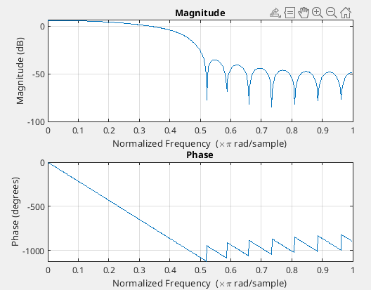
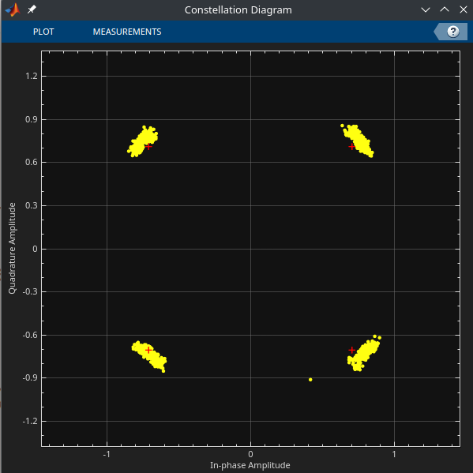

# ECE 531 | Digital Modulation: Symbol Synchronization

Name: Alan Manuel Loreto Cornidez

Course: ECE 531 | Software Defined Radio

Due Date: 02/19/2024

<!-- \newpage -->
<!-- \thispagestyle{empty} \clearpage \tableofcontents \pagenumbering{roman} -->
<!-- \clearpage \pagenumbering{arabic} \setcounter{page}{1} -->

## 1 | Overview and Objectives

In digital communications theory when matched filtering is discussed it is
typically called pulse shaping at the transmitter and matched filtering at the
receiver for reference.

- Make the signal suitable to be transmitted through the communication channel
  mainly by limiting its effective bandwidth
- Increase the SNR of the received waveform
- Reduce intersymbol interference (ISI) from multi-path channels and
  nonlinearities.

## 2 | Pulse Shaping and Matched Filtering

This section explores the use of the SRRC function to do filtering on a
transmitted signal to allow efficient, but precise interpretation of a signal,
even when noise is present.

### Section 2 | Questions

1. Explain the difference between type I and type II Nyquist filters.
   - A type-1 filter has an oscillation in the passband region, additionally,
     the type-1 filter has a steeper rolloff at the filter's frequency in the
     rejection band of the filter whereas the type-2 filter has no oscillation
     in the bassband frequency but at the cost of a slower rolloff. In addition,
     minor filter specifications are needed for a type-2 filter. Such as
     providing the frequency of the end of the rolloff period instead of the
     cuttoff frequency.
2. Generate frequency response plots for SRRC filter realizations with $\beta
   \in [0, 0.1, 0.25, 0.5, 1]$

Using the following matlab script to generate each frequency response graph:

```matlab
% set up filter parameters
beta = 0.25;
span = 6;
sps= 4;

h = rcosdesign(beta, span, sps, "sqrt");

freqz(h);
```

$\beta = 0$:

{ width=350px }

$\beta = 0.1$:

{ width=350px }

$\beta = 0.25$:

{ width=350px }

$\beta = 0.5$:

{ width=350px }

$\beta = 1$:

{ width=350px }

3. Generate transmit and receive plots similar to Figure 3 with
   <!-- prettier-ignore --> $\beta \in [0.1, 0.5, 0.9]$ and discuss the time
   domain effect.

Generating the image using `MATLAB` created the following figure:

{ width=350px }

As we can see, changing the $\beta$ inside of the SRRC changes the behavior of
the transmitted/received wave. We can see that the response of the wave has
differing amplitudes and slopes. What's interesting is that the slopes/maximum
points of each curve are not directly proportional to the $\beta$ value. We can
see that when `beta=0.5` the maximum value (and slope) of the curve is the
highest.

We can generate the figures for each beta values.

{ width=450px }

{ width=450px }

{ width=450px }

## 3 | Timing Error


### Section 3 | Questions

1. Regenerate Figure 6 with data from your Pluto SDR and explain why the
   constellation appears rotated. It may be helpful to start with
   `plutoLoopback.m`

{
width=350px }

## 4 | Symbol Timing Compensation

### 4.1 | Gardener

### 4.2 | Müller Mueller

### Section 4 | Questions

1. Starting with `TimingError.m`, which demonstrates a slowly changing timing
   offset, implement in MATLAB either the ZC, MM, or Gardner timing correction
   algorithm.

2. Provide error vector magnitude (EVM) measurements of the signal before an
   after your timing correction at different noise levels. (You may use the
   comm.EVM object in MATLAB.)
3. Introduce a fixed phase offset and repeat your EVM measurements from
   Question 1.

## 5 | Adding Pieces Together

### 5.1 | Questions

1. Provide your chosen arrangement of recovery blocks and reasoning behind their
   selected placement.
2. With your new receive chain, generate a received signal (before the receive
   filter in Figure 3) under the following conditions and provide EVM
   measurements after timing recovery:

- No offsets
- A fixed timing offset
- A fixed phase offset

Provide results over a small range of SNRs.

## 6 | Automatic Timing Compensation with Pluto

### 6.1 | Objective

### 6.2 | Testing on Hardware
