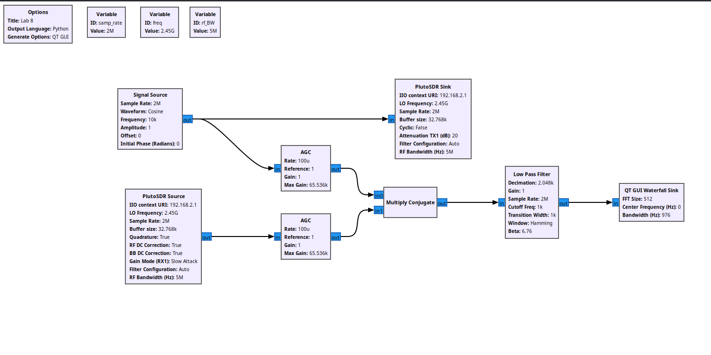

\newpage

\thispagestyle{empty} \clearpage \tableofcontents \pagenumbering{roman}
\clearpage \pagenumbering{arabic} \setcounter{page}{1}

# Questions

## Build your own CW radar with the PlutoSDR. What target(s) did you test against? Discuss results and observations in your lab report.

I worked with a friend to complete this lab. First we created an oscillating
signal that is sent as an output from the Pluto. The generated signal and the
received signal are then sent as inputs into AGC blocks. Using two automatic
gain control blocks (AGC) we can adjust the gain for the signals to not
overpower the inputs (since our antennas on the Pluto are very close), we input
the signal into the Multiply Conjugate block. This signal is then passed into a
lowpass filter through to a waterfall sing, this lets us visually see the output
of the Doppler effect in the CW radar on the Pluto's antennas.

## Explain more than one reason for the strong return at zero Hertz (DC)?

There can be multiple reasons for returns at Zero Hertz(DC) of the frequency
spectrum. Since continuous wave radar focuses on finding the Doppler shift
between the Tx and Rx signals, whenever a target is stationary, the heterodyned
signal is received as a DC signal (specifically because the signal is processed
into baseband.) Summarized as a list, here are some reasons for high returns as
zero hertz:

1. Stationary Rx and Tx antennas (relative to the other) being shifted to
   baseband causes zero hertz interpretation.
2. Reflections from other objects that are not meant to be detected, such as a
   wall, or a body of water.

## What can be can be changed with physically to reduce the DC return?

To reduce DC returns in the physical sense, you can remove obstructions that are
close to the radio, this will get rid of the stationary objects that do not
cause doppler shifts, thus, removing DC components.

## For CW radar, as implemented in this lab, how would an interfering signal affect its operation? What design changes can be made to improve its resilience to interference?

Depending on what the interfering signal is doing, our system can be affected in
many ways, if the interfering signal is returning a frequency that is being
transmitted at a few hertz off of our baseband (after translation to baseband),
then our system would interpret that signal as an object that is consistently
moving towards (or away from) our radio at a certain velocity.

If the signal that is interfering is a frequency shifting signal, we may
interpret that interference as an object that is approaching faster or slower
than the actual object movement speed.

## How can the system be changed achieve range measurements?

To find out range measurements of the target,you can timestamp the inputs, as
well as calculate the Doppler shift of the frequencies, this information used
together can allow you to calculate the range of the target using the following
formula:

$$R = c \frac{T}{2} \frac{\Delta f}{f_{2} - f_{1}}$$

Where: $c$ is the speed of light, $\Delta f$ is the difference between the
transmitted and received signals, $f_{2}$ is the maximum transmitted frequency,
$f_{1}$ is the minimum transmitted frequency, $T$ is the period between $f_{1}$
and $f_{2}$, and the velocity is given by $v = \frac{d R}{d t}$.

This information is from
[this reference](https://www.sciencedirect.com/topics/engineering/continuous-wave-radar).

## What is the approximate angular velocity of the objects measured?

From the formula given above, we can measure the velocity of the ojects that I
measure, such as my hand moving back and forth, in this case, my had will cause
a Hz reading that goes from $0$ Hz to $400$ in about 0.4 seconds, so, let's plug
in the numbers that we have. Recall, $T = 1 \times 10^{9}$ seconds, and the
speed of light is approximately, $c = 3 \times 10^{8}$.

$$
R = (3 \times 10^{8}) \frac{10^{9}}{2} \frac{400}{(2.495 \times 10^9) - 2.4
\times 10^{9}}
$$

# Conclusion

As a car enthusiast, I learned how I can make a radar jammer using my
ADALM-Pluto today, as a law abiding student, I have learned that it is easy to
break the law throughout the course of the semester. I have learned that I have
to be careful when and that I have to be careful when transmitting signals in
any way, even if it is only for fun. Implementing the CW Radar on the Pluto
brought a very practical perspective of physics into reality and it was cool to
finally see the theory being practiced in real life. Though the application for
SDR on the Pluto may be simple, the CW radar has applications in many spaces of
engineering. One of the most interesting applications that I found was the use
of CW radar to detect surface-to-air missile systems. This is important in the
modern day because being able to detect a missile as early as possible allows
leadership to act with as much time as possible. In addition, I also found it
interesting (in my wikipedia rabbit hold) that continuous wave radar is not the
only application of Dopper style radar. The idea of pulsed wave radar also came
up, and those topics were also interesting.

I digress, overall, the topics learned throughout the course have been a great
way to look into the practical applications of all of the digital signal
processing, control theory, and computer programming that I have learned over
the years as a student.
